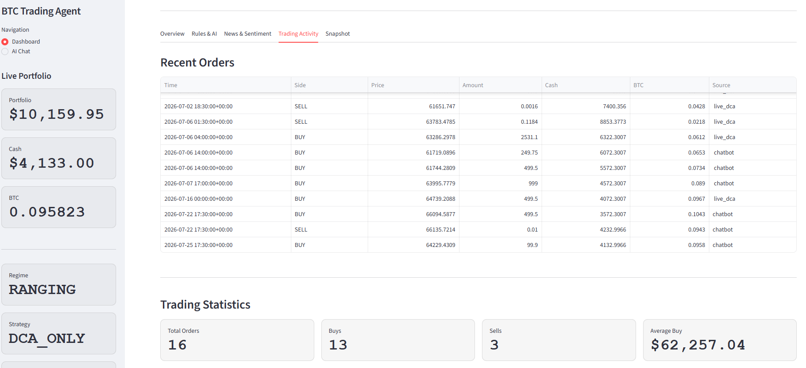
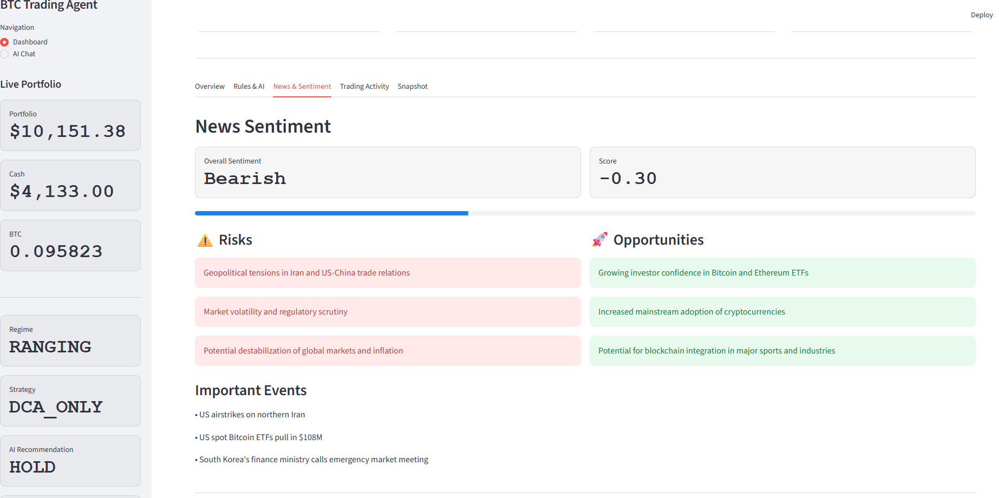
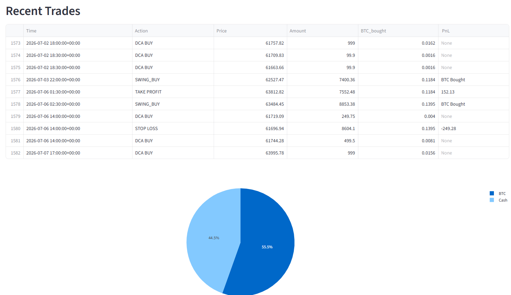
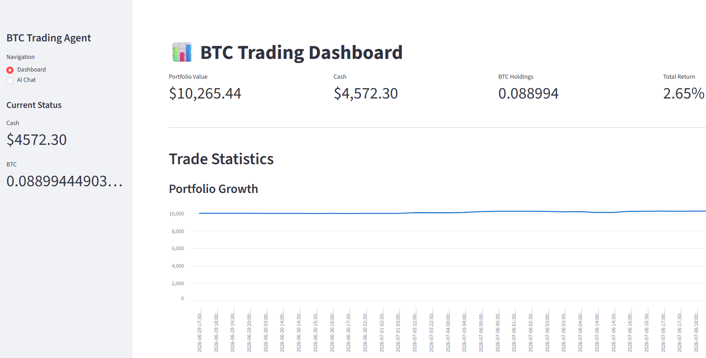
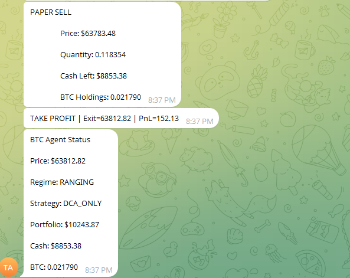
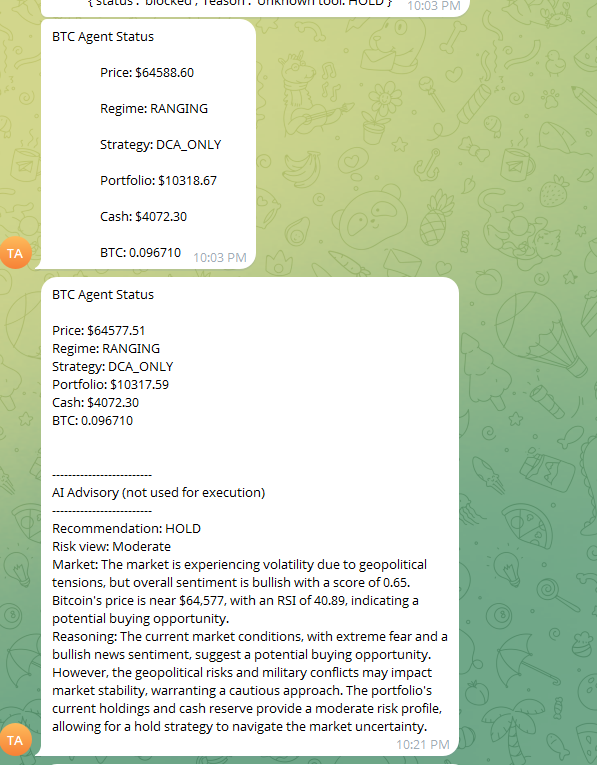

# AI-Powered Bitcoin Trading Agent

An end-to-end intelligent Bitcoin trading platform that combines **algorithmic
trading**, **technical analysis**, **Large Language Models (LLMs)**, **news
sentiment analysis**, **trading**, and an **interactive Streamlit
dashboard**.

The system executes rule-based trades while leveraging AI for explainable
portfolio analysis and market intelligence. It provides transparent
**BUY / HOLD / SELL** recommendations without ever letting the LLM directly
execute trades keeping the trading logic reliable, deterministic, and safe.

---

## Table of Contents

- [Features](#features)
- [Architecture](#architecture)
- [Project Structure](#project-structure)
- [How a Trading Cycle Works](#how-a-trading-cycle-works)
- [Technologies Used](#technologies-used)
- [Getting Started](#getting-started)
- [Configuration](#configuration)
- [Running the App](#running-the-app)
- [Dashboard](#dashboard)
- [AI Safety](#ai-safety)
- [Key Design Principles](#key-design-principles)
- [Future Improvements](#future-improvements)
- [Author](#author)
- [License](#license)
- [Images](#Images)

---

## Features

### Live Market Monitoring

- Downloads real-time Bitcoin market data
- Calculates technical indicators
- Detects the current market regime
- Chooses the appropriate trading strategy for that regime
- Tracks portfolio performance continuously

### Technical Indicators

The trading engine automatically computes:

| Indicator | What it measures |
|---|---|
| RSI | Momentum — overbought vs. oversold conditions |
| ATR | Volatility — used to size stops and exits |
| EMA50 | Short/medium-term trend direction |
| SMA50 | Longer-term trend direction |
| MACD | Trend strength and momentum shifts |
| Volume Indicators | Conviction behind price moves |
| Trend Analysis | Overall directional bias |

These indicators feed directly into every rule-based trading decision — the
AI reads them too, but only to *describe* what's happening, not to decide it.

### AI Portfolio Manager

The LLM analyzes:

- Technical indicators
- Portfolio allocation
- Market regime
- News sentiment
- Fear & Greed Index
- Current positions

...and produces:

- A BUY / HOLD / SELL recommendation
- A confidence score
- A risk assessment
- Portfolio health commentary
- A market summary
- Human-readable reasoning behind all of the above


### AI News Sentiment

The system automatically:

- Downloads recent Bitcoin news
- Extracts the most relevant articles
- Uses an LLM to summarize them
- Scores overall market sentiment on a **-1 to +1** scale
- Identifies:
  - Risks
  - Opportunities
  - Important events

Summarized results are cached locally (news_sentiment.json) and rendered on
the dashboard, so the LLM isn't re-queried on every page load.


### Rule-Based Trading Engine

Every trading decision is made through deterministic rules.

**Supported strategies:**

- Dollar Cost Averaging (DCA)
- ATR-based buying
- Swing Trading
- ATR Stop Loss
- Portfolio Stop Loss

The current **market regime** (trending, ranging, or panic) determines which
strategy is active at any given time — this mapping is fixed logic, not an
AI decision.

###  Portfolio Management

The system continuously tracks:

- Cash balance
- Bitcoin holdings
- Average DCA cost
- Active swing trades
- Total portfolio value
- Closed trades

All portfolio state is persisted locally, so it survives restarts.

###  Paper Trading

Every simulated order is recorded with:

- Side (buy/sell)
- Price
- Quantity
- Resulting cash balance
- Resulting BTC holdings
- Timestamp
- Order source (automated rule vs. chatbot-initiated)

**No real funds are used.** This is a simulation environment for strategy
validation and research.


###  Streamlit Dashboard

An interactive dashboard displaying:

**Portfolio**
- Portfolio value, cash, BTC holdings, returns

**Market**
- Current BTC price, RSI, ATR, EMA50, SMA50, regime, active strategy

**AI Portfolio Advisor**
- Recommendation, confidence, portfolio health, risk, market summary,
  reasoning

**News Sentiment**
- Overall sentiment, sentiment score, risks, opportunities, important events

**Trading Activity**
- Recent paper trades, portfolio history, allocation chart

###  AI Trading Assistant

An interactive chatbot, powered by an LLM, that understands natural-language
questions such as:

- "Show my portfolio"
- "How much BTC do I own?"
- "Show recent trades"
- "Explain today's market"
- "Should I buy Bitcoin?"
- "Show AI report"
- "Explain today's recommendation"
- "Show Bitcoin news"

The chatbot can also **initiate** paper trades through natural language:

```
Buy $500 Bitcoin
```
```
Sell 0.01 BTC
```

Even here, the LLM only *identifies intent* and calls a tool — the actual
trade still executes through the same deterministic `order_executor`
used by the automated engine. 

---

## Architecture

```
Market Data
      │
      ▼
Technical Indicators
      │
      ▼
Market Regime Detection
      │
      ▼
Strategy Selection
      │
      ▼
Rule-Based Trading Engine
      │
      ▼
Portfolio Manager
      │
      ▼
Paper Trading
      │
      ├──────────────► Portfolio History
      │
      ├──────────────► Trade Log
      │
      ▼
Market Context Builder
      │
      ▼
LLM Portfolio Advisor
      │
      ▼
AI Recommendation
      │
      ▼
Dashboard + Chatbot
```

Read top to bottom: data becomes indicators, indicators become a regime
classification, the regime picks a strategy, the strategy executes trades,
and only *after* all of that is the AI layer invoked to summarize what
already happened, not to influence it.

For a deeper breakdown of each module and how the layers interact, see
`architecture.md`. For the exact step order of a live trading cycle, see
`workflow.md`.

---

## Project Structure

```
project/
│
├── app.py                   # Application entry point
├── dashboard.py              # Streamlit dashboard UI
├── chatbot.py                 # Streamlit chatbot UI
│
├── core/
│   │
│   ├── market_data.py         # Fetches BTC market data (Yahoo Finance)
│   ├── indicators.py          # Computes RSI, ATR, EMA, SMA, MACD, etc.
│   ├── regime.py               # Classifies market regime
│   ├── strategy.py             # Maps regime → active strategy
│   │
│   ├── portfolio.py             # In-memory portfolio state
│   ├── portfolio_storage.py     # Reads/writes portfolio.json
│   ├── portfolio_history.py     # Historical portfolio snapshots
│   │
│   ├── order_executor.py         # Executes paper buy/sell orders
│   ├── atr_sell.py                # ATR-based trailing stop exits
│   ├── swing.py                    # Swing trade entries/exits
│   ├── risk_manager.py              # Portfolio-level risk controls
│   │
│   ├── market_context.py             # Aggregates state for the AI layer
│   ├── ai_advisor.py                  # Produces AI BUY/HOLD/SELL recommendation
│   │
│   ├── news.py                         # Fetches Bitcoin news (NewsAPI)
│   ├── news_sentiment.py                # LLM-based news summarization
│   ├── fear_greed.py                     # Fetches Fear & Greed Index
│   │
│   ├── llm_agent.py                       # Handles all Groq LLM communication
│   ├── assistant_prompt.py                 # System prompts for the chat assistant
│   ├── agent.py                              # Chatbot reasoning loop
│   ├── tools.py                               # Tool definitions for the chatbot
│   ├── tool_dispatcher.py                      # Routes LLM tool calls to functions
│   │
│   ├── telegram_bot.py                          # Sends trade/alert notifications
│   │
│   └── data/                                     # Local persisted state (JSON/CSV)
│
├── workflow.md                # Step-by-step trading cycle documentation
├── architecture.md             # Detailed system architecture documentation
└── README.md                    # You are here
```

---

## How a Trading Cycle Works

Every trading cycle follows the same fixed sequence:

1. Download the latest Bitcoin market data
2. Calculate technical indicators
3. Detect the current market regime
4. Select the appropriate trading strategy
5. Execute rule-based trades
6. Update the portfolio
7. Record paper orders
8. Save portfolio history
9. Build the market context object
10. Generate the AI advisory
11. Send a Telegram notification
12. Update the dashboard

Steps 1–8 are pure, deterministic trading logic. Steps 9–11 are advisory and
notification only by the time the AI is invoked, every trade for that
cycle has already executed and been saved.

---

## Technologies Used

| Category | Technology |
|---|---|
| Language | Python |
| Machine Learning | Large Language Models (LLMs) |
| Data Analysis | Pandas, NumPy |
| Visualization | Streamlit, Plotly |
| Market Data | Yahoo Finance |
| News | NewsAPI |
| Sentiment Input | Fear & Greed Index |
| LLM Provider | Groq API |
| Trading Mode | Paper Trading Engine (simulated, no real funds) |
| Notifications | Telegram Bot API |

---

## Getting Started

> Adjust the commands below to match your actual entry point and dependency
> manager if they differ — this section assumes a standard Python +
> Streamlit setup.

### Prerequisites

- Python 3.10+
- A [Groq API key](https://console.groq.com/) for LLM access
- A [NewsAPI key](https://newsapi.org/) for news ingestion
- A Telegram bot token, if you want trade/alert notifications
- `pip` for installing dependencies

### Installation

```bash
# Clone the repository
git clone https://github.com/Rinalpatel21/<repo-name>.git
cd <repo-name>

# Create and activate a virtual environment
python -m venv venv
source venv/bin/activate      # On Windows: venv\Scripts\activate

# Install dependencies
pip install -r requirements.txt
```

---

## Configuration

Create a `.env` file (or equivalent secrets file) in the project root with
your API credentials:

```env
GROQ_API_KEY=your_groq_api_key
NEWSAPI_KEY=your_newsapi_key
TELEGRAM_BOT_TOKEN=your_telegram_bot_token
TELEGRAM_CHAT_ID=your_telegram_chat_id
```

> Update the variable names above to match whatever your codebase actually
> reads — this is a placeholder based on the services listed in
> [Technologies Used](#technologies-used).

---

## Running the App

```bash
# Run one full trading cycle
python live_trading.py

# Launch the dashboard
streamlit run dashboard.py

# Launch the chatbot
streamlit run chatbot.py
```

---

## Dashboard

The Streamlit dashboard provides a single view combining:

- Portfolio analytics
- Performance tracking
- Market indicators
- AI recommendations
- News sentiment
- Trading history
- Portfolio allocation

---

## AI Safety

The LLM is **advisory only**. Structurally, it cannot:

- Execute trades
- Override trading rules
- Modify portfolio state

Only the deterministic rule engine (`order_executor.py`, guided by
`strategy.py`, `swing.py`, `atr_sell.py`, and `risk_manager.py`) is capable of
changing portfolio state. The AI advisor and chatbot are only ever given
*read* access to that state — they can describe it, but nothing in their code
path can write to it directly.

---

## Key Design Principles

- **Rule-based execution** — trading decisions are deterministic, not
  AI-driven
- **Explainable AI** — every recommendation comes with human-readable
  reasoning
- **Transparent recommendations** — confidence scores and risk levels are
  always shown, not hidden behind a single verdict
- **Deterministic trading** — the same inputs always produce the same trade
  decision
- **Modular architecture** — each concern lives in its own module
- **Persistent portfolio state** — nothing is lost on restart
- **Safe AI integration** — the LLM is sandboxed to read-only access

---

## Future Improvements

- Multi-asset support
- Live exchange integration
- Options strategies
- Multi-agent AI architecture
- Backtesting dashboard
- Performance analytics
- Cloud deployment

---

## Author

**Rinal Patel**

Data Science | Machine Learning | Generative AI | Financial Analytics

- GitHub: [Rinalpatel21](https://github.com/Rinalpatel21)
- LinkedIn: [rinalpatel-datascientist](https://linkedin.com/in/rinalpatel-datascientist)

---

## Images






